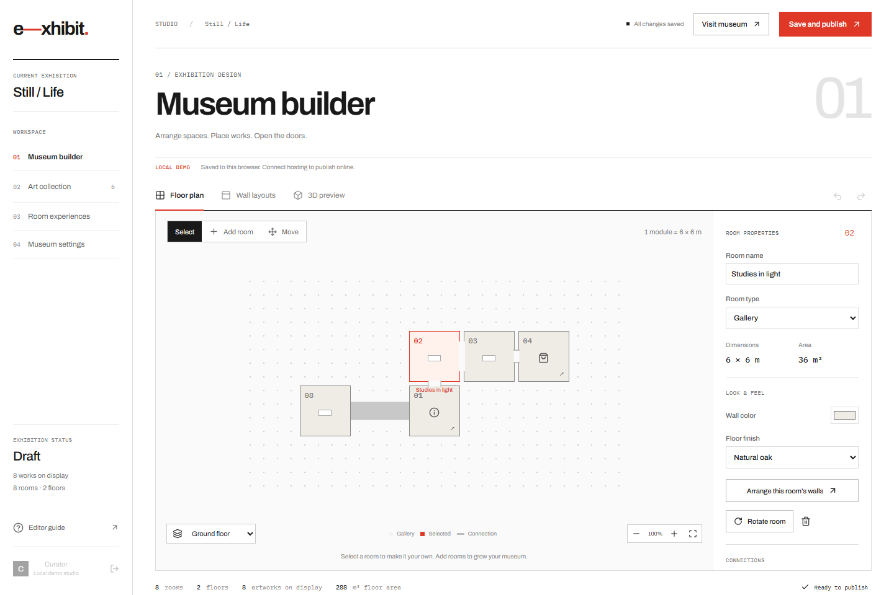
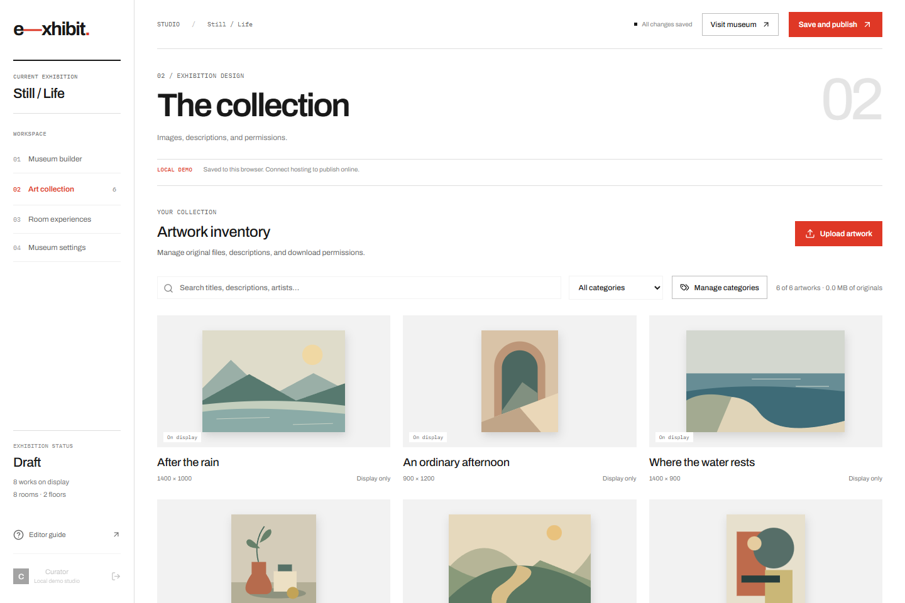
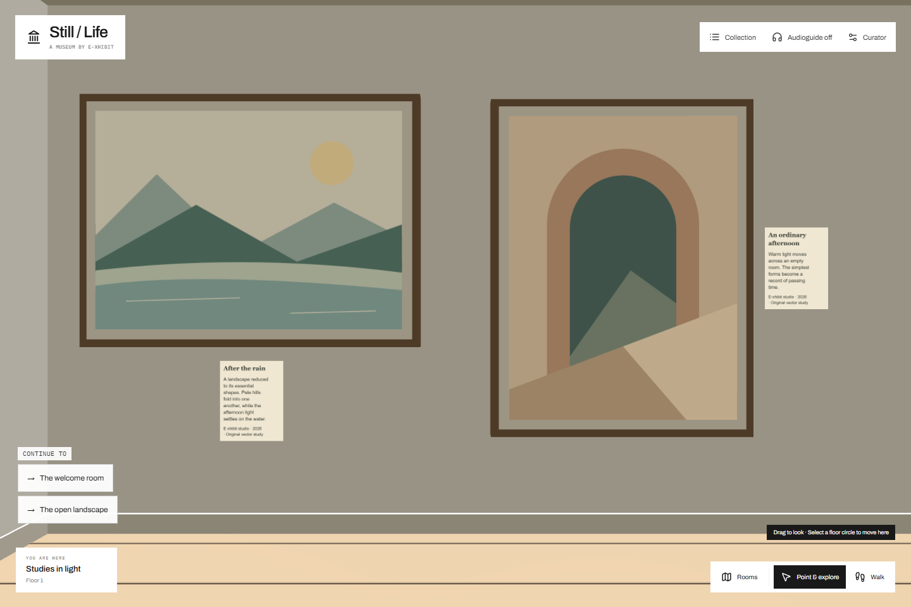

# E-xhibit

E-xhibit turns an image collection into a museum people can visit in their browser. Build rooms and floors, arrange artwork on the walls, add descriptions and frames, and publish a walkable 3D exhibition with a shareable address.

The studio includes a floor-plan editor, an artwork library, room previews, optional information books and download kiosks, and publication history. Visitors can walk through the museum, use point-and-click navigation, browse an accessible collection view, or listen to a device audioguide. Editing works best on a desktop; visiting also supports mobile devices.

## Screenshots

The included **Still / Life** sample exhibition uses original geometric illustrations.

**Design the museum:** arrange rooms, connections and stairs across multiple floors.



**Curate the collection:** upload images and manage titles, explanations, categories and download permissions.



**Visit the exhibition:** explore the rooms in 3D or open the collection view.



## Deploy your own exhibition

These instructions create a new installation. You do not need to run a server yourself: Cloudflare hosts the website, its API and image processing, private Cloudflare R2 buckets store the files, and Supabase provides sign-in and the database. Image preparation uses the Cloudflare Images binding included in the Worker configuration.

### Before you start

You will need:

- [Node.js](https://nodejs.org/en/download), version **22.19 or newer**, including npm.
- [Git](https://git-scm.com/downloads), to download the project.
- A [Cloudflare account](https://dash.cloudflare.com/sign-up) with R2 activated. R2 onboarding requires billing details.
- A [Supabase account](https://supabase.com/dashboard) and a new project.
- A text editor, such as [Visual Studio Code](https://code.visualstudio.com/), and a browser.

On Windows, open **PowerShell**. On macOS or Linux, open **Terminal**. Run the commands below in that window, one line at a time. Do not include the surrounding backticks. When an example contains `YOUR_...`, replace it with your own value.

**Costs:** each provider has its own allowances and limits. Cloudflare Images currently includes 5,000 unique transformations per month on its Free plan; additional transformations require its Paid plan. E-xhibit normally creates three display sizes when an image is uploaded and stores them in R2, so visitor views do not repeat those transformations. Images are stored in R2 rather than the separate Images storage product. Review [Images pricing](https://developers.cloudflare.com/images/pricing/), [R2 pricing](https://developers.cloudflare.com/r2/pricing/), [Workers pricing](https://developers.cloudflare.com/workers/platform/pricing/) and [Supabase pricing](https://supabase.com/pricing) before choosing plans. The default 20 GiB storage budget is an application safety limit; setting it does not reserve storage or charge you for 20 GiB. See the storage-budget explanation in step 9 before choosing your limit.

### 1. Download the project

```sh
git clone --branch v0.1.0 --depth 1 https://github.com/pablordgez/e-xhibit.git
cd e-xhibit
npm ci
```

Keep this terminal open in the `e-xhibit` folder for the remaining commands. `npm ci` installs the dependencies listed in the project; it does not deploy anything.

### 2. Choose your website address and sign in to Cloudflare

Start with a free `workers.dev` address. In the Cloudflare dashboard, open **Workers & Pages** and find or register your account's `workers.dev` subdomain. The Worker name supplied by this project is `e-xhibit`, so your address will be:

```text
https://e-xhibit.YOUR_SUBDOMAIN.workers.dev
```

Write down the complete address. You will use the same value in several settings. An **origin** means the `https://` scheme and hostname, without a trailing slash or a path such as `/admin`.

If you already have another Worker named `e-xhibit`, choose a different name in the top-level `name` field of `wrangler.jsonc` and use that name in the address. Wrangler is Cloudflare's deployment tool; this file tells it what to create and connect.

Now run:

```sh
npx wrangler login
```

A browser window opens. Sign in to the Cloudflare account you will use and approve Wrangler's access. See [Cloudflare's workers.dev guide](https://developers.cloudflare.com/workers/configuration/routing/workers-dev/) if the account has no subdomain yet.

### 3. Create the Supabase project and copy its connection details

1. In the Supabase dashboard, select **New project**, choose your organization, and give the project a name.
2. Generate a strong database password and save it securely. Choose a region near your expected editors and wait for the project to finish creating.
3. Use the project's **Connect** dialog to copy its **Project URL**, which looks like `https://YOUR_PROJECT.supabase.co`.
4. Open **Settings → API Keys** and copy a **publishable key** for the browser. Its value starts with `sb_publishable_`.
5. From the same page, create or copy a **secret key** for the Worker. Its value starts with `sb_secret_`. Store it securely; you will enter it into Cloudflare later.

The browser key is deliberately public. The secret key has privileged access and belongs only in Worker secrets. Keep the exact variable names shown in this guide: `VITE_SUPABASE_ANON_KEY` accepts a publishable key, and `SUPABASE_SERVICE_ROLE_KEY` accepts a secret key. Those names also support Supabase's legacy `anon` and `service_role` keys. See [Supabase's key guide](https://supabase.com/docs/guides/getting-started/api-keys) for where to find each type.

### 4. Create the database tables

1. In your text editor, open [supabase/migrations/001_museum.sql](supabase/migrations/001_museum.sql) from the downloaded project.
2. Copy the entire contents of that file.
3. In the Supabase dashboard, open **SQL Editor → New query**, paste the contents, and select **Run**.
4. Check that the query succeeds. In **Table Editor**, you should see `museum_members`, `museum_drafts` and `museum_assets`.

Run this file once on your new project. It creates the tables, enables row-level security, and restricts database access to the backend. Do not enable public table access to work around a sign-in error.

### 5. Create your owner account

1. Open Supabase's **Authentication** settings. Under the sign-up/user-sign-up settings, disable **Allow new users to sign up**. Accounts will be created by you or invited from the studio.
2. In **Authentication → URL Configuration**, set **Site URL** to the website address from step 2.
3. Add that address followed by `/admin` to **Redirect URLs**, for example `https://e-xhibit.YOUR_SUBDOMAIN.workers.dev/admin`. Save the settings.
4. Open **Authentication → Users → Add user → Create new user**. Enter your email address and a strong password. Enable **Auto Confirm User**, or mark the user's email as confirmed in the dashboard.
5. Open the created user and copy its **User UID**. This is a UUID identifying the account, not an API key.
6. In **SQL Editor**, run this query after replacing both example values:

```sql
insert into public.museum_members (user_id, email, role)
values ('YOUR_AUTH_USER_UUID', 'you@example.com', 'owner');
```

Replace `YOUR_AUTH_USER_UUID` with the UID you just copied, keeping the single quotes. The account must exist in Authentication before this query can succeed. The installation has one owner; other members have the `editor` role.

### 6. Create the private R2 buckets

1. In Cloudflare, open **R2 Object Storage** and complete its activation if needed.
2. Select **Create bucket**. Name the first bucket **`e-xhibit`**, use **Standard** storage, and keep the default jurisdiction and automatic location selection.
3. Create a second bucket named **`e-xhibit-display`** with the same settings. The supplied configuration binds both buckets to the Worker.
4. In each bucket's settings, leave **Public Development URL** disabled and do not attach an R2 public custom domain. The application serves authorized files through the Worker.
5. Copy your Cloudflare **Account ID** from the R2 overview or account sidebar.

These bucket names match `wrangler.jsonc`. If you choose different names, change both entries under `r2_buckets` and set `R2_BUCKET_NAME` to your first bucket's name. Use the default jurisdiction: the application's signed preview URLs use the standard R2 account endpoint.

### 7. Create read-only credentials for private image previews

1. From the R2 overview, open **Manage R2 API Tokens** and create a token.
2. Give it a recognizable name, such as `e-xhibit-preview`.
3. Select **Object Read only** permissions and restrict it to the first bucket, `e-xhibit`.
4. Create the token and save its **Access Key ID** and **Secret Access Key** securely. Cloudflare shows the secret at creation time.

You need the S3-compatible access-key pair, not the separate API token string. The Worker uses this read-only pair to sign private previews; its R2 binding handles writes. See [Cloudflare's R2 token instructions](https://developers.cloudflare.com/r2/api/tokens/) if the token screen has different labels.

### 8. Configure the browser

Create a local settings file:

```sh
cp .env.example .env.local
```

`cp` also works in PowerShell. Open `.env.local` in your text editor and replace the two example values:

```dotenv
VITE_SUPABASE_URL=https://YOUR_PROJECT.supabase.co
VITE_SUPABASE_ANON_KEY=YOUR_PUBLISHABLE_KEY
```

Save the file. Use the URL and **publishable** key from step 3. This file is ignored by Git. Never put the secret key, R2 credentials or database password in a variable beginning with `VITE_`: those variables become part of the website downloaded by visitors.

### 9. Configure the Worker

Open `wrangler.jsonc`. Under `vars`, replace these values and keep the others unless you want different limits:

| Setting             | What to enter                                                            |
| ------------------- | ------------------------------------------------------------------------ |
| `SUPABASE_URL`      | The same Supabase project URL as in `.env.local`.                        |
| `APP_ORIGIN`        | The complete HTTPS website origin from step 2, without a trailing slash. |
| `R2_ACCOUNT_ID`     | Your Cloudflare Account ID from step 6.                                  |
| `R2_BUCKET_NAME`    | `e-xhibit`, or the first bucket name you chose.                          |
| `MAX_UPLOAD_BYTES`  | Maximum original file size in bytes. Default: `100000000` (100 MB).      |
| `MAX_IMAGE_PIXELS`  | Maximum original width × height. Default: `100000000` (100 megapixels).  |
| `MAX_STORAGE_BYTES` | Total application allocation budget. Default: `21474836480` (20 GiB).    |

Keep values inside quotes, as in the supplied file. A 20 MB upload limit would be `"20000000"`. The supported byte limit is between 1 and 500,000,000; the pixel limit is between 1 and 100,000,000. Your Cloudflare plan's [incoming request-size limit](https://developers.cloudflare.com/workers/platform/limits/) still applies, so raising the application limit does not raise the provider limit.

Keep the `IMAGES`, `MUSEUM`, `DISPLAY`, `AUTH_LIMITER`, `CREATE_LIMITER` and scheduled-cleanup configuration. If other Workers in this account use rate-limit namespace IDs `1001` or `1002`, choose two unused, distinct IDs instead. If Wrangler asks which account to deploy to, select the account containing your R2 buckets; you can also set its Account ID in a top-level `account_id` field.

The browser prepares a small display master automatically, and Cloudflare decodes it and generates display images up to 2048 pixels on the longest edge. The original file remains unchanged in private R2 storage. Originals above 20 MB work with this flow; Cloudflare's decoder receives the small master. The [Images binding](https://developers.cloudflare.com/images/optimization/binding/) is deployed with the Worker.

#### What the 20 GiB storage budget means

`MAX_STORAGE_BYTES` controls how much storage work E-xhibit may allocate. The default is **20 GiB** (`21474836480` bytes); GiB is a size unit, and this setting has no currency value. It does not preallocate an empty 20 GiB bucket, buy a plan, or create an immediate bill. The per-image upload limit is controlled separately by `MAX_UPLOAD_BYTES`.

The budget covers originals, display images, temporary uploads and copies kept for publications. Publishing makes an independent copy of the displayed artwork, and older publications remain stored for restoration. The application also reserves space before work starts. Its safety counter is conservative and partly cumulative: interrupted work and deleted files may remain counted to prevent delayed writes from bypassing the limit. The counter can therefore be higher than the actual stored-file total shown in the studio. Keep the `control/` objects intact; deleting those records would remove the accounting safeguards.

If the next upload or publication would exceed the configured budget, E-xhibit refuses that new allocation. It does not delete your images or erase an existing exhibit. You can choose a different limit by changing `MAX_STORAGE_BYTES` and redeploying; a lower limit does not remove existing data.

**Cloudflare billing uses actual usage, independently of this counter.** R2 Standard currently includes **10 GB-month of storage per month**, shared across the account rather than granted separately to each bucket. Roughly, storing 10 GB throughout a whole month uses 10 GB-month. A configured 20 GiB application limit allows enough storage to exceed that free allowance, but charges depend on what you actually store and for how long. Both E-xhibit buckets contribute to R2 usage. See [R2 pricing and its storage examples](https://developers.cloudflare.com/r2/pricing/).

If you want a smaller application limit, for example **8 GiB**, use `"MAX_STORAGE_BYTES": "8589934592"`. This leaves some storage headroom, but it is not a spending cap: other buckets on your account, request operations, Images transformations, Workers and Supabase have their own usage and allowances. Review the provider dashboards and pricing when estimating costs.

### 10. Allow your website to read private previews

Open the first R2 bucket, **`e-xhibit` → Settings → CORS Policy → Add/Edit**. Paste this JSON, replacing the example origin with the same value as `APP_ORIGIN`, and save:

```json
[
  {
    "AllowedOrigins": ["https://e-xhibit.YOUR_SUBDOMAIN.workers.dev"],
    "AllowedMethods": ["GET", "HEAD"],
    "AllowedHeaders": ["Content-Type"],
    "ExposeHeaders": ["ETag"],
    "MaxAgeSeconds": 300
  }
]
```

This lets your browser read signed preview URLs. It does not make the bucket public. Browser uploads go through the Worker, so this policy does not need `PUT` permissions. See [R2 CORS configuration](https://developers.cloudflare.com/r2/buckets/cors/).

### 11. Set up cleanup for interrupted uploads

Run:

```sh
npx wrangler r2 bucket lifecycle add e-xhibit security-staging-cleanup staging/ --expire-days 2 --abort-multipart-days 2
npx wrangler r2 bucket lifecycle list e-xhibit
```

Use your first bucket's name if you changed it. The first command adds a rule named `security-staging-cleanup` that expires temporary objects under **only `staging/`** after two days and aborts incomplete multipart uploads under that prefix after two days. It changes the remote bucket's settings; it does not delete the exhibition immediately. R2 applies lifecycle cleanup asynchronously.

The command should report that it added the rule. The list command should show an enabled rule with that name, the `staging/` prefix, a two-day expiration and a two-day multipart-abort period. If it fails, fix the account/permission or bucket error before continuing. Do not create a bucket-wide expiration rule: originals, variants, publications and control records must be retained. The Worker's separate hourly cleanup is already configured in `wrangler.jsonc`. See [R2 lifecycle rules](https://developers.cloudflare.com/r2/buckets/object-lifecycles/).

### 12. Build and deploy

Save your configuration files, then run:

```sh
npm run deploy
```

This builds the website and uploads it together with the API Worker. Wrangler lists the bindings and prints the deployed address. Check that the address matches `APP_ORIGIN`. If it differs, correct the origin in `wrangler.jsonc`, Supabase's Site URL/redirect settings and R2 CORS, then run the deployment command again.

The first deployment creates the Worker. Complete the secrets in the next step before using the studio.

### 13. Install the Worker secrets

Run each command separately. When Wrangler prompts for a value, paste the corresponding secret and press Enter. The input is not displayed as plain text.

```sh
npx wrangler secret put SUPABASE_SERVICE_ROLE_KEY
npx wrangler secret put R2_ACCESS_KEY_ID
npx wrangler secret put R2_SECRET_ACCESS_KEY
```

| Secret name                 | Value to paste                            |
| --------------------------- | ----------------------------------------- |
| `SUPABASE_SERVICE_ROLE_KEY` | The Supabase **secret** key from step 3.  |
| `R2_ACCESS_KEY_ID`          | The R2 **Access Key ID** from step 7.     |
| `R2_SECRET_ACCESS_KEY`      | The R2 **Secret Access Key** from step 7. |

Each command should confirm that the secret was uploaded. You can verify their names with:

```sh
npx wrangler secret list
```

The list shows names, not the secret values. In the Cloudflare Worker dashboard, you should also see your runtime variables, the two R2 bindings, the Images binding, the rate-limit bindings and the cleanup schedule. Do not save these secret values in `wrangler.jsonc` or commit them to Git.

### 14. Sign in and publish your first exhibition

1. Open your website address followed by **`/admin`**.
2. Sign in using the owner email and password from step 5.
3. The studio starts with the **Still / Life** sample draft. In **Museum settings**, change the museum name and introduction.
4. Use **Art collection → Upload artwork** to add JPEG, PNG or WebP files. Add their titles, descriptions and attribution, and choose download permissions for each image.
5. Use **Museum builder** to arrange rooms and open their wall layouts to place artwork. **Room experiences** configures optional books and shops.
6. Open the **3D preview** and check the rooms, images and navigation. Resolve any validation messages.
7. Select **Save and publish**, review the publication dialog, and confirm publication. Wait for completion before closing the tab.
8. Open the website's root address in a private/incognito browser window. Your exhibition should load without signing in. Check both the 3D gallery and **Collection** view.

Before the first publication, public visitors see an unpublished-museum message. Draft edits remain private until you publish. Visitors already viewing a version keep that version; new visits use the latest publication.

Enabling an image's download permission makes its original available through a published download kiosk/shop. Leave the permission off for display-only artwork. Display images can still be saved by visitors, as with any website.

### 15. Optional: invite other editors

Configure a custom SMTP email provider in Supabase's Authentication email settings before sending invitations to other people. Supabase's built-in email service is restricted to project-team addresses and is intended for testing. Follow [Supabase's SMTP guide](https://supabase.com/docs/guides/auth/auth-smtp).

Then sign in as the owner, open **Museum settings**, and use the editor invitation form. The recipient follows the email link to `/admin`, sets a password and can edit the museum. The owner can revoke editor membership in the same section.

### 16. Optional: use your own domain

After the `workers.dev` installation works, open your Worker in Cloudflare and add a **Custom Domain** under its domain/route settings. Use a hostname on a domain managed by that Cloudflare account, such as `museum.example.com`.

Set `APP_ORIGIN` to the new HTTPS origin, update Supabase's Site URL and `/admin` redirect URL, and replace the origin in R2 CORS. Run `npm run deploy` again. Use one canonical origin for editing and sign-in; the CORS and redirect settings must agree with it. Attach the custom domain to the **Worker**, keeping the R2 buckets private.

### Troubleshooting and ongoing use

| Symptom                                                      | What to check                                                                                                                                           |
| ------------------------------------------------------------ | ------------------------------------------------------------------------------------------------------------------------------------------------------- |
| The terminal cannot find `node`, `npm` or `git`.             | Install the missing prerequisite, then close and reopen the terminal.                                                                                   |
| Deployment fails or uses another Cloudflare account.         | Run `npx wrangler whoami`; confirm the selected account owns both buckets and has R2 enabled.                                                           |
| Sign-in fails.                                               | Confirm the email/password and confirmed-email status in Supabase. Check the two browser variables, then rebuild with `npm run deploy` if they changed. |
| Sign-in works but the studio says the account has no access. | Check the `museum_members` row and ensure `user_id` equals the Authentication user's UID.                                                               |
| The database is unavailable.                                 | Confirm the Worker secret and Supabase URL belong to the same project, and that step 4's tables/grants exist.                                           |
| Private image previews fail.                                 | Check the read-only R2 key pair, Account ID, bucket name and exact CORS origin.                                                                         |
| Image preparation fails.                                     | Check the Images binding and plan allowance, file/pixel limits, browser WebP support and available allocation budget.                                   |
| The public page says the museum is unpublished.              | Finish a successful publication in the studio; saving the draft alone does not publish it.                                                              |
| Invitations fail.                                            | Check custom SMTP, allowed recipient addresses and the Supabase `/admin` redirect URL.                                                                  |

#### Export and restore your draft

**Museum settings → Export museum document** downloads `museum-backup.json`, containing the working draft's rooms, floors, artwork placements and descriptions, categories, books and settings. The JSON references image files; it does not contain them, editor accounts or publication history. Back up both private R2 buckets and the Supabase database separately, keeping the existing object keys and asset records intact.

To restore an exported draft:

1. Sign in to the studio and open **Museum settings → Import museum document**.
2. Choose your exported JSON file. Existing version 1 exports are supported. JSON files can be up to 16 MiB; the document itself must also fit the application's normal save limit.
3. Review the exhibit name and counts in the confirmation dialog. **Download current draft** saves a copy of the draft you are about to replace; **Cancel** leaves it unchanged.
4. Select **Replace draft**. The application validates the document and checks that its uploaded images still exist in this installation before saving the replacement. Wait for the imported-and-saved confirmation. Invalid documents, missing images and conflicting edits stop the import without replacing your working draft.
5. Review the restored draft. During the same editing session, **Museum builder → Undo** can return to the previous draft. The undo history is cleared when you reload the page.
6. Publish separately when ready. Import does not change the exhibition that visitors currently see.

Import restores a draft into the installation that contains its image files and asset records. For recovery into another installation, restore the database and both R2 backups first; the JSON alone cannot recreate those files or records. Local-demo exports must be imported into the browser that still contains their image data.

**Published versions → Restore** switches the public exhibition to a retained version without replacing the working draft. Originals, display images and retained versions all contribute to storage use.

### Try it locally or contribute

To explore without hosting accounts, download the project as in step 1 and run `npm run dev` before creating `.env.local`. Open [localhost:5173](http://localhost:5173). The local demo stores the exhibition in that browser, including uploaded images, and `/visit` opens the sample or your local publication. It does not publish a website. Production studio access always requires sign-in.

The project uses React, TypeScript, Vite and Babylon.js. To validate changes locally, run the browser suites sequentially:

```sh
npm run build
npm test
npx playwright install chromium
npm run test:e2e
npm run test:production
npm run worker:check
```

## License

E-xhibit and its included sample illustrations are released under the [MIT License](LICENSE). Artwork you upload remains subject to its own rights and permissions.
